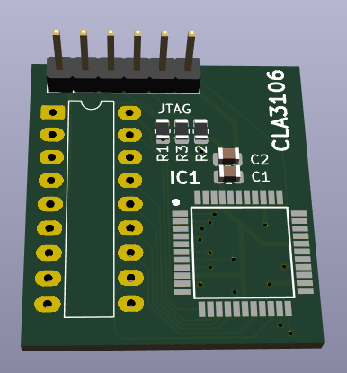

# Datron-1281-CLA3106-ASIC
Drop-in replacement for Datrons custom ASIC CLA3106 with a 5V CPLD

The Datron 1281 & 1271 multimeters and some Datron products use a custom ASIC for the serial communication inside the instrument. This ASIC in its basic function is nothing more than a bidirectional shift register with error detection. After carefully studying the service manual and making some measurements in my Datron 1281, I was able to replicate the functions of this ASIC. Now a 5V ATMEL CPLD ATF1504 can do the job of this irreplaceable IC. I designed a little PCB which can be installed in a DIP socket. If a CLA3106 breaks, it can be replaced with this PCB. No further modifications are needed.

The CPLD can be ordered preprogrammed from Digikey or programmed by yourself, if you have the necessary equipment. The firmware for the ATF1504 ist in the CLA3106.jed file. The KiCAD project files, Gerber and BOM are all in this repository. I hope with this project some old Datron equipment can be saved.
